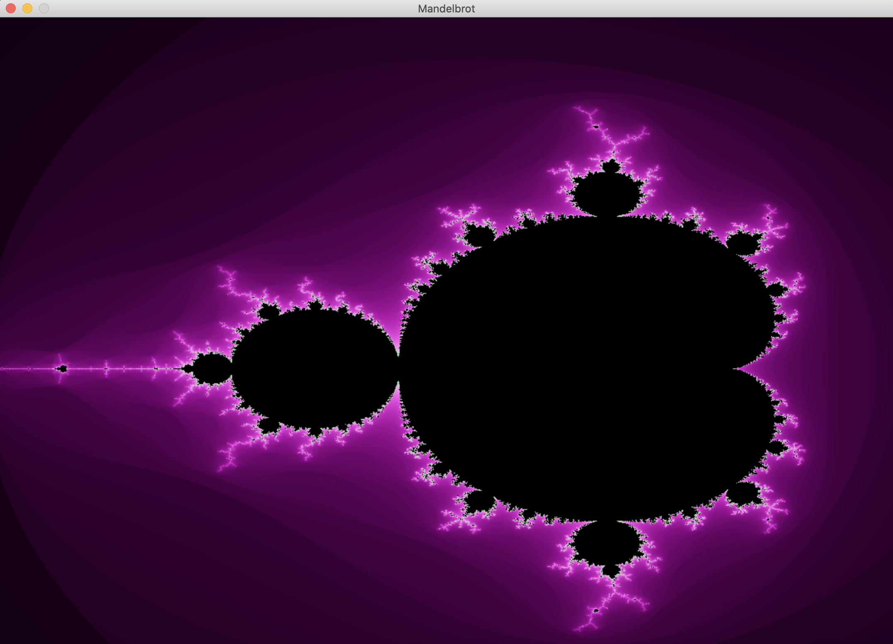

# fract-ol

<p align="center">
  
</p>

One of the first graphical projects at 42 school, fract-ol generates beautiful fractals from the complex numbers of an iterative mathematical construct. A fractal is a fragmented geometrical figure that infinitely repeats itself at smaller scales. This project uses the school's graphical library, MiniLibX.



# Usage

---

Note that this project was tested on MacOS only. It may run on Linux with small adjustments to the Makefile. [42 Docs](https://harm-smits.github.io/42docs/libs/minilibx/getting_started.html).

---

## Installing and Compiling Fract-ol

Clone the repository, including the embedded MiniLibX repository:
```shell
git clone https://github.com/kilchenk/Fract-ol.git && cd Fract-ol
```

You will now be in the correct directory for compilation. Compile with ```make```. Fract-ol should now be ready!

## Executing Fract-ol

At execution time, you must specify a fractal to display. You may also provide other optional parameters:

```shell
./fractol <type> <options>
```

Types are :
* ```Mandelbrot```: Mandelbrot fractal
* ```Julia```: Julia fractal
* ```Burningship```: Burning Ship fractal

## Fract-ol Controls

While Fractol is running, the following set of controls are available:

<table>
  <tr><td><strong>Controls</strong></td><td><strong>Action</strong></td></tr>
  <tr><td><kbd>&nbsp;▲&nbsp;</kbd><kbd>&nbsp;◄&nbsp;</kbd><kbd>&nbsp;▼&nbsp;</kbd><kbd>&nbsp;►&nbsp;</kbd></td><td>Move</td></tr>
  <tr><td><kbd>&nbsp;scroll wheel&nbsp;</kbd></td><td>Zoom in and out</td></tr>
  <tr><td><kbd>&nbsp;space&nbsp;</kbd></td><td>Change color scheme</td></tr>
  <tr><td><kbd>&nbsp;W&nbsp;</kbd><kbd>&nbsp;A&nbsp;</kbd><kbd>&nbsp;S&nbsp;</kbd><kbd>&nbsp;D&nbsp;</kbd></td><td>Shift Julia set [Julia only]</td></tr>
  <tr><td><kbd>&nbsp;esc&nbsp;</kbd> or close window</td><td>Quit fract-ol</td></tr>
</table>

# Example

## Mandelbrot set


# 


## Julia set


## Burning ship set


#


---
Made by kilchenk: kilchenk@student.42wolfsburg.de | LinkedIn: [kilchenk](https://www.linkedin.com/in/kyrylo-ilchenko/)
